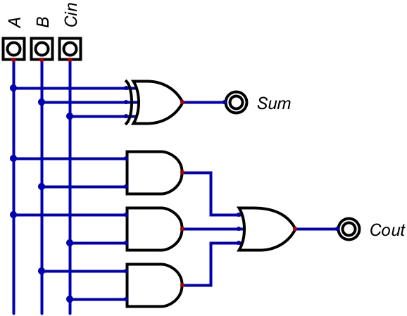

# Summary
The ripple-carry adder computes the sum of two 2-bit binary numbers by combining the outputs of a half adder and full adder, then outputs the sum and carry bit (carryout).

Both a half adder and full adder were constructed before the RCA to demonstrate how they combine to form the RCA.

Diagrams and truth tables for all adders are documented below. At the bottom of this report, you will find example images of the RCA breadboard circuit.

The RCA consists of an 8-pin switch array, an XOR gate, an AND gate, an OR gate, and a 10-LED array. More details on these components are available in the [Materials List](/materials_list.md).

---

# Half Adder

## Truth Table for Half Adder
| A | B | Carry | Sum |
| :---: | :---: | :---: | :---:|
| 0 | 0 | 0 | 0 |
| 0 | 1 | 0 | 1 |
| 1 | 0 | 0 | 1 |
| 1 | 1 | 1 | 0 |

## Circuit Diagram for Half Adder

## Wiring Diagram for Half Adder

---

# Full Adder

## Truth Table for Full Adder
| A | B | C_in | C_out | Sum |
| :---: | :---: | :---: | :---: | :---: |
| 0 | 0 | 0 | 0 | 0 |
| 0 | 0 | 1 | 0 | 1 |
| 0 | 1 | 0 | 0 | 1 |
| 0 | 1 | 1 | 1 | 0 |
| 1 | 0 | 0 | 0 | 1 |
| 1 | 0 | 1 | 1 | 0 |
| 1 | 1 | 0 | 1 | 0 |
| 1 | 1 | 1 | 1 | 1 |

## Circuit Diagram for Full Adder

## Wiring Diagram for Full Adder

---

# Ripple-Carry Adder (RCA)

## Truth Table for RCA
| A_1 | A_0 | B_1 | B_0 | C_out | S_1 | S_0 |
| :---: | :---: | :---: | :---: | :---: | :---: | :---: |
| 0 | 0 | 0 | 0 | 0 | 0 | 0 |
| 0 | 0 | 0 | 1 | 0 | 0 | 1 |
| 0 | 0 | 1 | 0 | 0 | 1 | 0 |
| 0 | 0 | 1 | 1 | 0 | 1 | 1 |
| 0 | 1 | 0 | 0 | 0 | 0 | 1 |
| 0 | 1 | 0 | 1 | 0 | 1 | 0 |
| 0 | 1 | 1 | 0 | 0 | 1 | 1 |
| 0 | 1 | 1 | 1 | 1 | 0 | 0 |
| 1 | 0 | 0 | 0 | 0 | 1 | 0 |
| 1 | 0 | 0 | 1 | 0 | 1 | 1 |
| 1 | 0 | 1 | 0 | 1 | 0 | 0 |
| 1 | 0 | 1 | 1 | 1 | 0 | 1 |
| 1 | 1 | 0 | 0 | 0 | 1 | 1 |
| 1 | 1 | 0 | 1 | 1 | 0 | 0 |
| 1 | 1 | 1 | 0 | 1 | 0 | 1 |
| 1 | 1 | 1 | 1 | 1 | 1 | 0 |

## Circuit Diagram for RCA

## Wiring Diagram for RCA

## Top Down View of RCA

## Angled View of RCA

